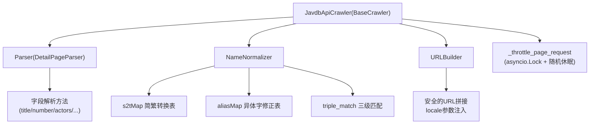
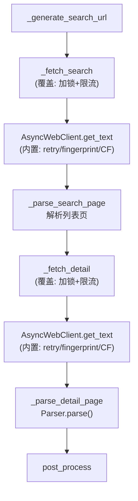
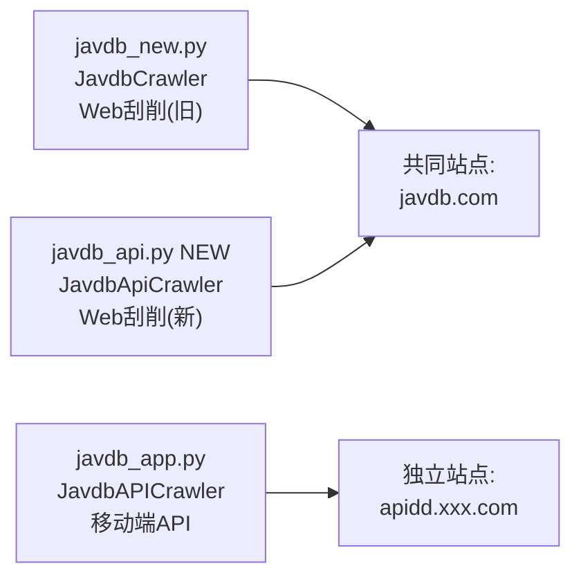

# JavdbApi Scraper

Feature Name: javdb-api-scraper
Updated: 2026-07-17

## Description

基于 javdbapi Go SDK 的核心设计思想，用 Python 实现一个新的 JAVDB Web 刮削源 `JavdbApiCrawler`。与现有的 `JavdbCrawler`（`javdb_new.py`）相比，本刮削源引入了 javdbapi 的演员名规范化模块、URL 构建器、更完整的页面解析架构。

本刮削源继承 `BaseCrawler` + `DetailPageParser` 模式，与 `javdb_new.py` 完全一致的基类使用方式。限流、重试、Cloudflare 绕过等基础设施直接复用 `AsyncWebClient` 已有能力，不自建轮子。

## Architecture

### 模块关系



### 数据流



### 与同级刮削源的定位



## Components and Interfaces

### 1. NameNormalizer — 演员名规范化

基于 javdbapi `ids.go` 移植，纯函数模块，包含字符映射表和匹配算法。

**s2tMap 简繁转换表**（完整移植 javdbapi 的映射表）：

```python
s2t_map = {
    '樱': '櫻', '咏': '詠', '艺': '藝', '泽': '澤', '桥': '橋',
    '优': '優', '爱': '愛', '苍': '蒼', '罗': '羅', '条': '條',
    '东': '東', '广': '廣', '发': '發', '义': '義', '乌': '烏',
    '书': '書', '务': '務', '备': '備', '复': '復', '刘': '劉',
    '动': '動', '协': '協', '单': '單', '国': '國', '园': '園',
    '岛': '島', '乡': '鄉', '枫': '楓', '结': '結', '圣': '聖',
    '宫': '宮', '绪': '緒', '铃': '鈴', '镜': '鏡', '长': '長',
    '门': '門', '间': '間', '阳': '陽', '阴': '陰', '风': '風',
    '飞': '飛', '龙': '龍', '龟': '龜', '马': '馬', '鸟': '鳥',
    '鱼': '魚', '钟': '鐘', '银': '銀', '驱': '驅', '韩': '韓',
    # ... 完整表见 javdbapi ids.go
}
```

**aliasMap 异体字修正表**：

```python
alias_map = {
    '筱': '篠',
    '穗': '穂',
    '理': '裏',
    '户': '戸',
}
```

**NormalizeName 流程**：先简繁转换 → 再异体字修正

```
输入: "筱田优"
  → toTraditional: "筱田优" (无变化)
  → aliasMap: "篠田優"
输出: "篠田優"
```

**ActorByName 三级匹配**：

```
SearchActors("篠田優")
  → 返回 [{ID: "WE4e", Name: "篠田優", Aliases: [...]}]
  → Level 1: Name=="篠田優" → 命中, 返回 WE4e
  → Level 2: Name.contains("篠田")
  → Level 3: charsOverlap(Name, input) > 0
```

### 2. URLBuilder — URL 构造器

基于 javdbapi `internal/siteurl/build.go` 移植，静态方法集合：

```
Video:       {base_url}/v/{id}?locale=zh
Search:      {base_url}/search?q={keyword}&f=all&page={n}&locale=zh
SearchActor: {base_url}/search?q={name}&f=actor&page={n}&locale=zh
Home:        {base_url}/{type}?vft={filter}&vst={sort}&page={n}&locale=zh
MakerVideos: {base_url}/makers/{id}?f={filter}&sort_type={n}&page={n}&locale=zh
ActorVideos: {base_url}/actors/{id}?t={filters}&sort_type={n}&page={n}&locale=zh
Ranking:     {base_url}/rankings/movies?p={period}&t={type}&page={n}&locale=zh
```

`base_url` 从 `manager.config.get_site_url(Website.JAVDB_API, "https://javdb.com")` 获取。

### 3. 限流模式（复用框架现有限流）

不复用 javdbapi 的令牌桶。本软件 `AsyncWebClient` 已提供：
- 每域名 `AsyncLimiter`（默认 8 req/s）
- Cloudflare 5 秒盾自动 bypass
- 浏览器指纹伪装
- 自动重试（`retry_count` 参数）

本刮削源仅追加 JAVDB 特有的请求间隔控制，与 `javdb_new.py` 完全一致：

```python
async def _throttle_page_request(self, ctx, request_type: str, url: str) -> None:
    now = time.monotonic()
    if self._last_page_request_at > 0:
        interval = random.uniform(1.0, 2.0)
        wait_seconds = interval - (now - self._last_page_request_at)
        if wait_seconds > 0:
            ctx.debug(f"JavdbApi 请求限流({request_type})，等待 {wait_seconds:.2f}s: {url}")
            await asyncio.sleep(wait_seconds)
    self._last_page_request_at = time.monotonic()

@property
def _page_request_lock(self) -> asyncio.Lock:
    if not hasattr(self, '_lock'):
        self._lock = asyncio.Lock()
    return self._lock
```

### 4. Parser — 详情页解析器

继承 `DetailPageParser`（与 `javdb_new.py` 共用同一基类），每个字段为独立 async 方法。

从 javdbapi 引入的新字段解析逻辑：

| 字段 | 选择器 | 来源 |
|------|--------|------|
| `score` | 正则 `(\d+(?:\.\d+)?)\s*分\s*,\s*由\s*(\d+)\s*人評價` | javdbapi `score.go` |
| `wanted` | 正则 `([0-9,]+)人(?:想看\|想要)` | javdbapi `detail.go` |
| 演员性别区分 | 演员链接后的 `symbol.female` / `symbol.male` | javdbapi `detail.go` |

### 5. 番号日期格式转换

基于 javdbapi `command_video.go` 的日期格式处理逻辑，内嵌在 `_generate_search_url` 中：

```python
# 处理日期格式番号: "XXX-21.06.11" -> "XXX-20210611"
if "." in number:
    m = re.search(r"\D+(\d{2}\.\d{2}\.\d{2})$", number)
    if m:
        old_date = m.group(1)
        new_date = "20" + old_date.replace(".", "")
        number = number.replace(old_date, new_date)
```

### 6. JavdbApiCrawler — 主爬虫类

```python
class JavdbApiCrawler(BaseCrawler):
    parser = Parser()

    def __init__(self, client, base_url="", browser=None):
        super().__init__(client, base_url, browser)
        self._page_request_lock = asyncio.Lock()
        self._last_page_request_at = 0.0

    @classmethod
    def site(cls) -> Website:
        return Website.JAVDB_API

    @classmethod
    def base_url_(cls) -> str:
        return manager.config.get_site_url(Website.JAVDB_API, "https://javdb.com")

    def _get_headers(self, ctx) -> dict | None:
        if manager.config.javdb:
            return {"cookie": manager.config.javdb}

    async def _generate_search_url(self, ctx) -> list[str]:
        number = ctx.input.number.strip()
        # 日期格式转换...
        return [f"{self.base_url}/search?q={number}&locale=zh"]

    async def _parse_search_page(self, ctx, html, detail_url) -> list[str] | None:
        # Cloudflare/版权拦截检测
        # 解析 .box 列表
        # 精确匹配 → 模糊匹配

    async def _parse_detail_page(self, ctx, html, detail_url) -> CrawlerData | None:
        javdbid = 从 detail_url 正则提取
        return await self.parser.parse(ctx, html, external_id=javdbid)

    async def post_process(self, ctx, res) -> CrawlerResult:
        # 字段修正: originaltitle/poster/mosaic/trailer
```

### 与 javdb_new.py 的关键差异

| 方面 | javdb_new.py (旧) | javdb_api.py (新) |
|------|------------------|-------------------|
| 演员名匹配 | 无规范化能力 | 简繁转换+异体字修正+三级匹配 |
| 评分解析 | 简单正则 | 带评价人数的完整解析 |
| 演员性别 | 全视为 female | 通过 symbol 区分性别 |
| 搜索页解析 | 直接 XPath | 间接通过 URLBuilder 构造 |
| 代码架构 | 无独立模块 | NameNormalizer/URLBuilder 独立 |
| 日期格式处理 | 无 | 自动转换 `21.06.11` 为 `2021-06-11` |

## Data Models

### Website 枚举值

`mdcx/config/enums.py` 新增：

```python
JAVDB_API = "javdb_api"
```

### NameNormalizer 模块内部数据类型

```python
# 无需 dataclass，纯函数接口
def normalize_name(name: str) -> str: ...
def actor_by_name(client, name: str) -> tuple[str, str] | None:  # (id, name)
```

## Correctness Properties

1. **演员名称确定性**: 同一演员名经 `normalize_name` 处理后始终产生相同的归一化结果
2. **容错独立性**: 单个字段解析失败不影响其他字段的值
3. **框架一致性**: 不引入任何框架中已有的能力（限流/重试/CF绕过/指纹伪装）

## Error Handling

| 错误场景 | 错误类型 | 处理方式 |
|---------|---------|---------|
| Cloudflare 拦截 | `CrawlerException` | 提示更换 cookie |
| 版权限制（日本 IP） | `CrawlerException` | 提示更换非日本代理 |
| 搜索无结果 | 返回 `None` | 框架自动处理 |
| 详情页解析失败 | `CrawlerException` | 框架自动记录错误 |
| Cookie 无效 | 403/404 响应 | `_fetch` 返回 None，框架兜底 |

## File Changes

### 新增文件

```
mdcx/crawlers/javdb_api.py   — JavdbApiCrawler + Parser + NameNormalizer + URLBuilder
```

### 修改文件

```
mdcx/config/enums.py          — Website 新增 JAVDB_API = "javdb_api"
mdcx/crawlers/__init__.py     — import + register_crawler(JavdbApiCrawler)
```

### 不修改的文件

```
mdcx/crawlers/base/base.py    — 现有基类足够，无需变更
mdcx/web_async.py             — 限流/重试/CF绕过框架已有，不引入新逻辑
mdcx/config/models.py         — javdb cookie 配置项直接复用现有字段
```

## Test Strategy

### 单元测试

| 测试项 | 文件 | 内容 |
|-------|------|------|
| NameNormalizer | `test_name_normalizer.py` | s2tMap 映射、aliasMap 修正、三级匹配 |
| Parser 字段解析 | `test_parser.py` | 各字段选择器匹配、缺失字段容错 |

### 测试策略

- NameNormalizer 为纯函数，可完全离线测试
- Parser 使用 fixture HTML（从真实页面保存）测试，不依赖网络
- 爬虫主流程继承 `javdb_new.py` 的测试经验，不重复编写集成测试

## References

- `mdcx/crawlers/javdb_new.py` — 同站旧刮削源，代码结构和限流模式可复用
- `mdcx/crawlers/base/parser.py` — DetailPageParser 基类
- `mdcx/crawlers/base/base.py` — BaseCrawler 基类
- `mdcx/web_async.py` — AsyncWebClient（内置限流/重试/CF绕过）
- `mdcx/config/enums.py` — Website 枚举
- `mdcx/config/models.py` — Config 模型（javdb cookie 配置）
- [javdbapi ids.go](https://github.com/cdlongbow/javdbapi/blob/master/ids.go) — 演员名规范化
- [javdbapi internal/siteurl/build.go](https://github.com/cdlongbow/javdbapi/blob/master/internal/siteurl/build.go) — URL 构建
- [javdbapi internal/scrape/detail.go](https://github.com/cdlongbow/javdbapi/blob/master/internal/scrape/detail.go) — 详情页解析逻辑
- [javdbapi internal/scrape/list.go](https://github.com/cdlongbow/javdbapi/blob/master/internal/scrape/list.go) — 列表页解析逻辑
- [javdbapi internal/scrape/actor_search.go](https://github.com/cdlongbow/javdbapi/blob/master/internal/scrape/actor_search.go) — 演员搜索页解析
- [javdbapi internal/scrape/score.go](https://github.com/cdlongbow/javdbapi/blob/master/internal/scrape/score.go) — 评分解析
- [javdbapi internal/scrape/size.go](https://github.com/cdlongbow/javdbapi/blob/master/internal/scrape/size.go) — 磁力大小/文件数解析